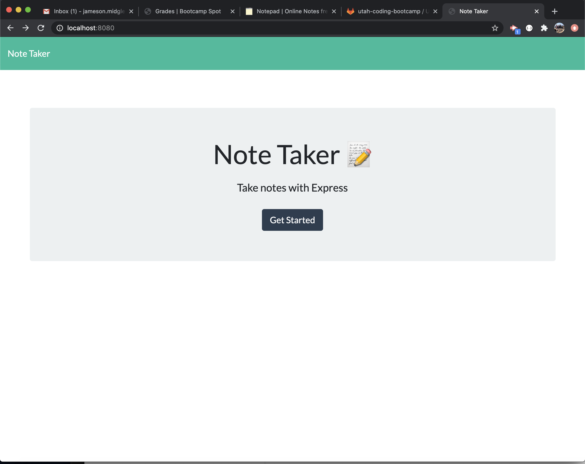
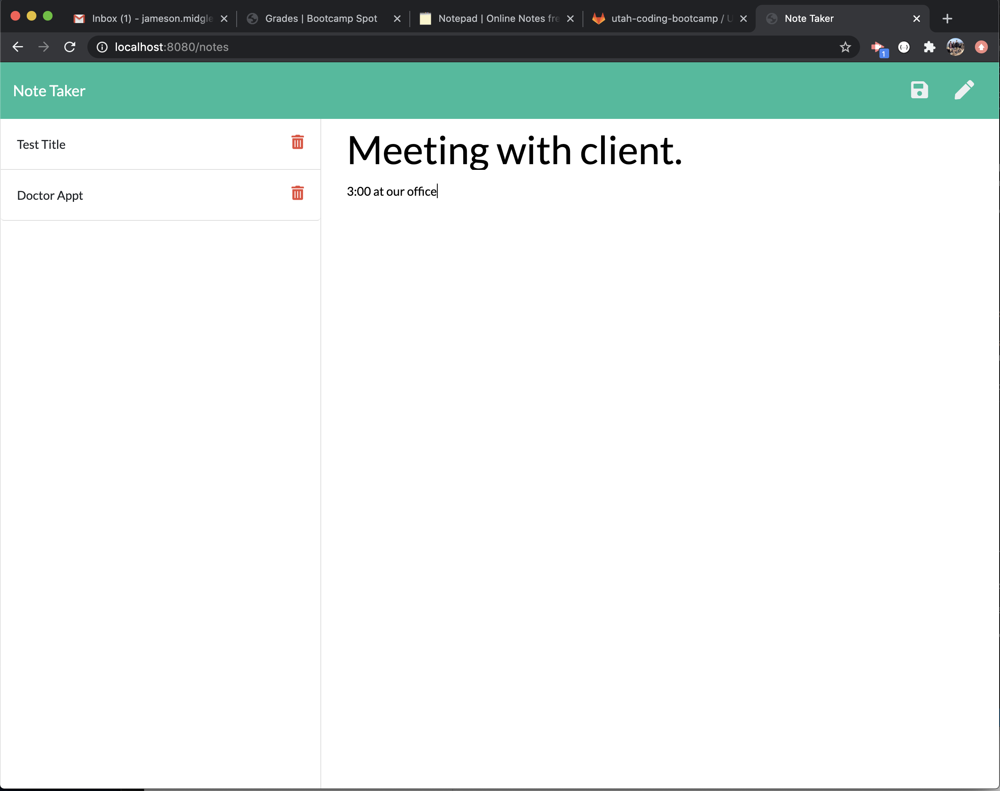
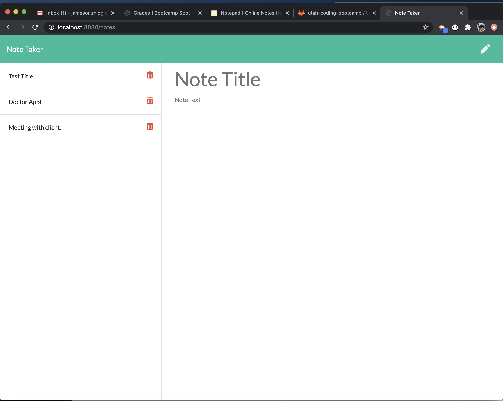
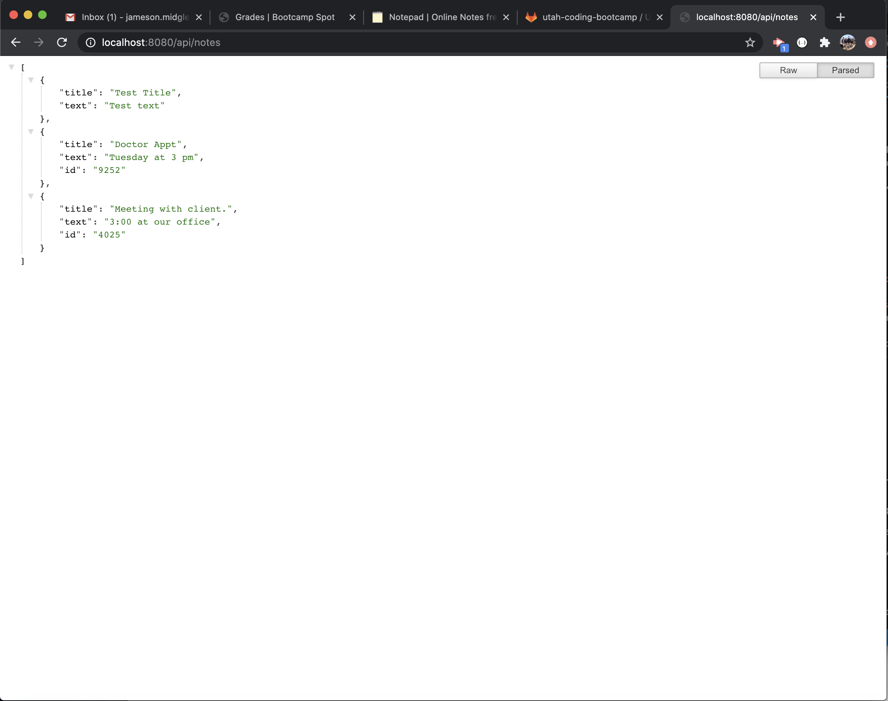
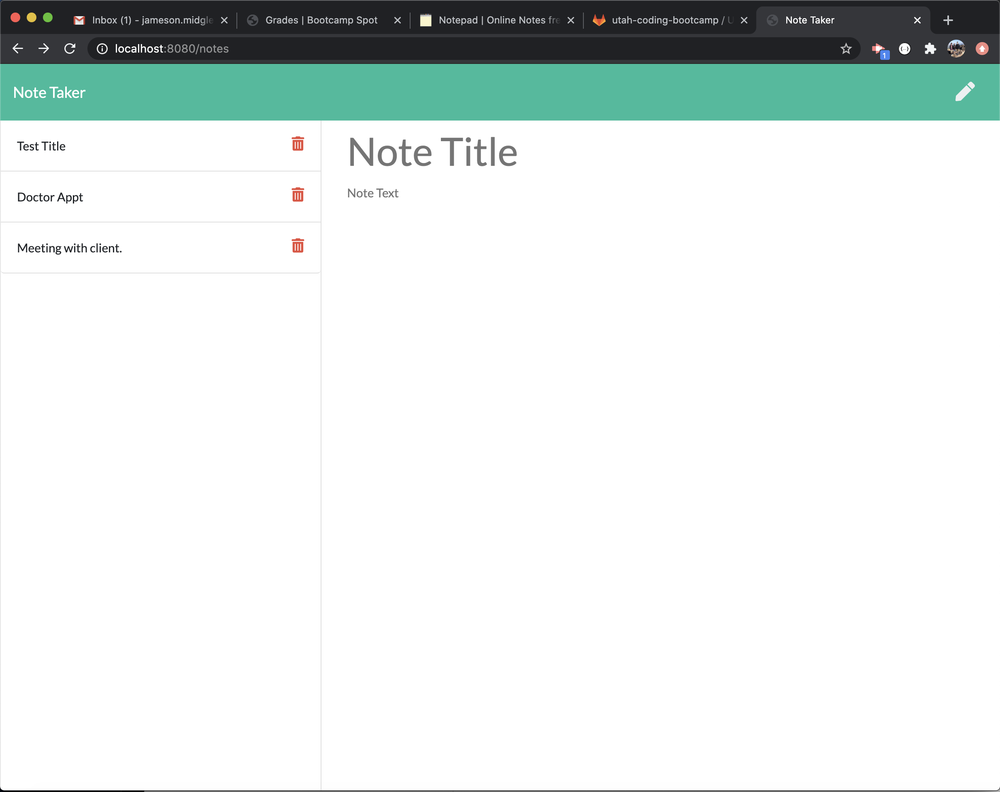
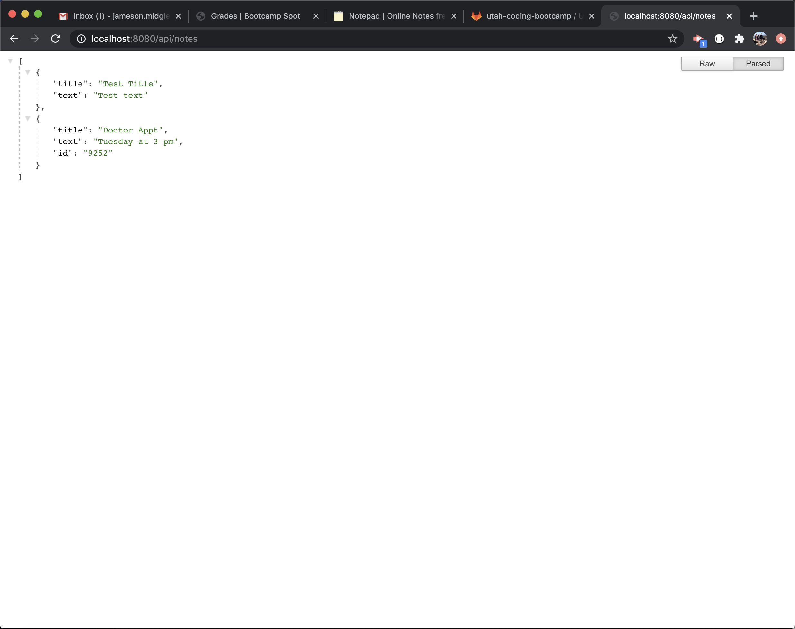

# Note Taker Homework 11  

## Introduction  

This assignment was given for any user of the program to write notes that save and persist to the page. Also have the capability to take down the notes. This assignment was for the benefit of using express to set up paths for a deployed site. We then used Heroku to deploy the working app.

## Table of Contents:  
* [Objectives](#Objectives)
* [Process](#Process)
* [Challenges](#Challenges)
* [Summary](#Summary)
* [Sites](#Sites)
* [Screenshots](#Screenshots)

## Objectives  

```md
As a user, I want to be able to write and save notes
I want to be able to delete notes I've written before
So that I can organize my thoughts and keep track of tasks I need to complete.
```

## Process  

* I first copied the homework into my own repository for the assignment.  
* I then installed npm i and express into my repository. 
* I then created a server.js file that serves as the listening file for node.js
* I then went and gathered from past activities much of the boiler plate for dependencies, paths, and listeners.  
* I then continued to hone down into the paths to get all the html and api pages working.
* I then added app.post and app.delete functions for the notes to be added and deleted.
* I then set up a deployed app with Heroku showing the final project.    

## Challenges  

This assignment had a lot of headache for me! I got the boiler plate dependencies and paths for the server.js file. I ran into a problem with the /api/notes file not wanting to render at all. I conversed and looked over classmate's code and found it to look the same but it still wouldn't load. After leaving it and working on other projects, I came back and it worked. I don't understand why, because I didn't change anything. Perhaps another program was using my localhost:8080. After I got that figured out, it was trying to build correct json paths for notes to be added and deleted. After some trial and error, activity searching, and googling, I looked to some classmates for help which I was able to learn a lot. I also had trouble deploying to Heroku by not having a buildpack. A learning assistant explained I needed to have my package.json file in my root directory which fixed the problem.

## Summary  

This assignment was another fun challenge for me. I am having a slower time grasping some concepts for back-end as opposed to front-end, but I am slowly figuring things out. When they do work correctly, it brings immense pleasure. It is interesting to see how paths and things can link up code and how express can make things easier than just going through node. Excited to continue my learning journey!

## Sites  

* [Link to deployed app on Heroku](https://mysterious-wave-79346.herokuapp.com/)
* [Link to repository on GitHub](https://github.com/j-midgley13/note-taker-hw11)

## Screenshots









